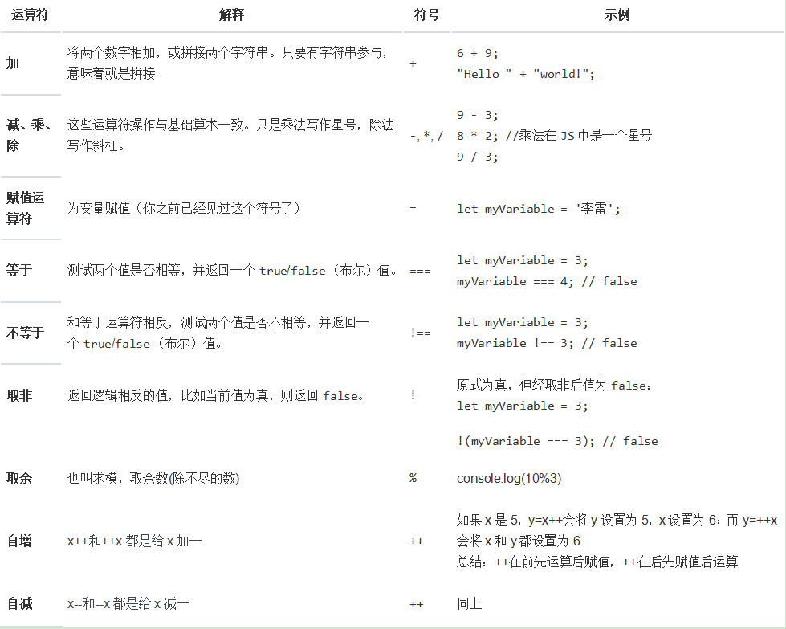

<!-- TOC -->

- [JS基础](#js基础)
    - [JS定义](#js定义)
    - [JS到底是什么](#js到底是什么)
    - [JS书写位置方式](#js书写位置方式)
    - [JS常见语句](#js常见语句)
    - [JS注释](#js注释)
    - [JS变量](#js变量)
        - [什么是变量](#什么是变量)
        - [声明变量](#声明变量)
        - [变量求值](#变量求值)
        - [变量的作用域](#变量的作用域)
        - [变量提升](#变量提升)
    - [JS常量](#js常量)
    - [JS数据类型和数据结构](#js数据类型和数据结构)
        - [JS数据类型](#js数据类型)
    - [运算符](#运算符)
        - [算术运算符](#算术运算符)

<!-- /TOC -->

# 1. JS基础

## 1.1. JS定义
- `JS`：是JavaScript的简称，它是一种具有函数优先级的轻量级，解释型或即时编译型的编程语言
- 虽然`JS`是作为开发web页面的脚本语言而出名的，但是它也被用到了很多`非浏览器环境`中，例如 Node.js、 Apache CouchDB 和 Adobe Acrobat。JavaScript 是一种基于原型编程、多范式的动态脚本语言，并且支持面向对象、命令式和声明式（如函数式编程）风格。了解更多 JavaScript

## 1.2. JS到底是什么
- JS是一门完备的动态编程语言，应用于HTML文档时，可以为网站提供动态交互特性
- JS的应用场合极其广泛，有简单到幻灯片、照片库、浮动布局和响应按钮点击，复杂到游戏、2D、3D动画、大型数据库驱动程序
- JS相当简介，却非常灵活，开发者们基于 JavaScript 核心编写了大量实用工具，可以使 开发工作事半功倍，其中包括：
    - 浏览器应用程序接口(API)—浏览器内置的API提供了丰富的功能，比如：动态创建HTML和CSS样式、从用户的从用户的摄像头采集处理视频流、生成3D 图像与音频样本，等等
    - 第三方API—让开发者可以在自己的站点中整合其它内容提供者（Twitter、Facebook 等）提供的功能
    - 第三方框架和库 —— 用来快速构建网站和应用

## 1.3. JS书写位置方式
1. 内联式

    `script type="text/javascript">alert("Hello World");</script>`

2. 外链式

    `<script src="./my.js"></script>`
3. 行内式

    `<p onclick="alert('Hello World');">Click Me</p>`

注：我们将`<script>`放在HTML文件的底部附近的原因是浏览器会按照代码在文件中的顺序加载 HTML。如果先加载的 JavaScript 期望修改其下方的 HTML，那么它可能由于 HTML 尚未被加载而失效。因此，将 JavaScript 代码放在 HTML页面的底部附近通常是最好的策略

## 1.4. JS常见语句
- 弹出窗口：alert()
- 在页面中输出信息：document.write()
- 在控制台输出信息：console.log()

## 1.5. JS注释
- 单行注释: //
- 多行注释: /**/
- 注释快捷键: Ctrl+/

## 1.6. JS变量

### 1.6.1. 什么是变量
`变量`：是存储值得容器，使用变量来作为值得符号名。变量的名字又叫做标识符

需要遵守一定的规则
- 变量命名必须以字母、下划线”_”或者”$”为开头。其他字符可以是字母、_、美元符号或数字
- 变量名中不允许使用空格和其他标点符号，首个字不能为数字
- 变量名区分大小写(javascript是区分大小写的语言)
- 不能使用脚本语言中保留的关键字、保留字、true、false 和 null 作为标识符


需要遵守一定的规范
- 变量名必须要有意义
- 遵守驼峰命名法
- 建议不要用$作为变量名

### 1.6.2. 声明变量
可以用三种方式来声明变量
- 使用关键字 `var` 
    - var x = 10;该语法可以用来声明局部变量和全局变量
- 直接复制
    - 例如：x = 10;
    - 该方式若在函数外使用这种形式赋值，会产生一个全局变量，在严格模式下会产生错误，因此不能使用这种方式来声明变量
- 使用关键字 `let` 
    - 例如：let x = 10;g
    - 该方式可以用来声明作用域的局部变量

### 1.6.3. 变量求值
用 `var` 和 `let` 语句声明的变量，如果没有赋初始值，则其值为 `undefined`

如果访问一个未声明的变会导致抛出一个引用错误异常(ReferenceError)
```
var a;
console.log(a);  // a 的值为：undefined

console.log(c);  // Uncaught ReferenceError: c is not defined
```
也可以使用 `undefined` 来判断一个变量是否已赋值，例如：在下面的代码中，变量 `input` 未被赋值，所有 `if` 条件语句的求值结果为 `true`
```
var input;
if (input === undefined) {
    console.log("input变量未赋值！");
}else{
    console.log("input变量已赋值！");
}
// 结果为：input变量未赋值！
``` 
数值类型环境中 `undefined` 值会被转为 `NAN`
```
var b;
console.log(b+2);  // NAN
console.log(typeof(NAN));  // undefined
```

### 1.6.4. 变量的作用域
`全局变量` : 在函数之外声明的变量，叫做全局变量，因为它可被当前文档中的任何其他代码所访问

`局部变量` : 在函数内部声明的变量，叫做局部变量，因为它只能被当前函数的内部访问

```
var scope = "global";
function ActionScope() {
    console.log(scope); // undefined
    var scope = "local";
    console.log(scope); // local
}
ActionScope();
```
在这里我们可能会下意识的人为第一句输出的值为：global，想法是没错的，但是选错了对象，首先在这里要说明一下`JavaScript` 的函数作用域和 `Java` 的代码块作用域。

在 `Java` 中花括号内的每一段代码都具有各自的作用域，而且变量在声明它们的代码段之外是不可见的；但是 `JavaScript` 压根就没有块级作用域，而是函数作用域

什么是函数作用域：就是变量在声明它们的函数体以及这个函数嵌套的任意函数体内都是有定义的

所以，上面的代码可重写如下：
```
var scope = "global";
function ActionScope() {
    var scope; // 声明局部变量，覆盖同名的全局变量
    console.log(scope); // undefined
    var scope = "local";
    console.log(scope); // local
}
ActionScope();
```
在函数里面再次声明了同名的变量scope，相当于在函数内部声明的局部变量覆盖了同名的全局变量

### 1.6.5. 变量提升

`变量提升` ：JS中的变量有一个不同寻常的地方是，你可以先使用变量稍后再声明变量而不会引发异常，这一概念称为变量提升；`JavaScript` 变量感觉上是被“提升”或移到了函数或语句的最前面。但是，提升后的变量将返回 `undefined` 值。因此在使用或引用某个变量之后进行声明和初始化操作，这个被提升的变量仍将返回 `undefined` 值

```
console.log(x === undefined); // true
var x = 3;

// will return a value of undefined
var myvar = "my value";
(function() {
  console.log(myvar); // undefined
  var myvar = "local value";
})();
```
上面的例子也可以写作：
```
var x;
console.log(x === undefined); // true
x = 3;

var myvar = "my value";
(function() {
  var myvar;
  console.log(myvar); // undefined
  myvar = "local value";
})();
```

## 1.7. JS常量
`常量` : JS中一旦被定义就无法再被修改的变量，称之为常量

常量规则
- 常量：不能修改的值
- 常量的关键字只能是const 
- 常量只能读取，不能修改

常量的标识符命名规则和变量相同
- 变量命名必须以字母、下划线”_”或者”$”为开头。其他字符可以是字母、_、美元符号或数字
- 变量名中不允许使用空格和其他标点符号，首个字不能为数字
- 变量名区分大小写(javascript是区分大小写的语言)
- 不能使用脚本语言中保留的关键字、保留字、true、false 和 null 作为标识符

常量不可以通过重新赋值改变其值，也不可以在代码运行时重新声明，它必须被初始化为某个值，如下：
> const PI = 3.14

常量的作用域规则与 `let` 块级作用域变量相同，若省略 `const` 关键字，则该标识符将被视为变量

在同一作用域中，不能使用与变量名或函数名相同的名字来命名常量，例如：
```
function f(){};
const f = 5;
// Uncaught SyntaxError: Identifier 'f' has already been declared
```
然而对象属性被赋值为常量是不受保护的，所有下面的语句执行时不会产生错误：
```
const MY_OBJECT = {"key": "value"};
MY_OBJECT.key = "otherValue";
```
同样的，数组的被定义为常量也是不受保护的，所以下面的语句执行时也不会产生错误：
```
const MY_ARRAY = ['HTML','CSS'];
MY_ARRAY.push('JAVASCRIPT');
console.log(MY_ARRAY); //logs ['HTML','CSS','JAVASCRIPT'];
```

## 1.8. JS数据类型和数据结构

### 1.8.1. JS数据类型
JS中的数据类型分为两种，一种是基本数据类型，一种是引用数据类型

- 基本数据类型
> number类型：数字

typeof()方法：查看变量i数据类型
```
var i = 10;
console.log(i + "是" + typeof(i) + "类型"); // number
var i2 = 10.2;
console.log(i2 + "是" + typeof(i2) + "类型"); // number
```
结果
```
10是number类型
10.2是number类型
```
> string类型：字符串
```
var str = "Hello JS";
console.log(str + "是" + typeof(str) + "类型");

结果
Hello JS是string类型
```
> boolean类型：布尔类型
```
var t = true;
var f = false;
console.log(t + "是" + typeof(t) + "类型");
console.log(f + "是" + typeof(f) + "类型");

结果
true是boolean类型
false是boolean类型
```
> undefined类型：未定义类型
```
var und ;
console.log("und的值是：" + und);
console.log(und + "是" + typeof(und) + "类型");

结果
1、未被赋值的变量值是undefined
2、未被赋值的变量的类型也是undefined
```
> null类型：空引用
```
var n = null;
console.log(n + "是" + typeof(n) + "类型");
结果
null是object类型
```
- 引用类型
> 引用数据类型有：数组、函数、对象、正则、日期


## 1.9. 运算符

### 1.9.1. 算术运算符

> 算术运算符：+ - * / = != ! % ++ --
```
// + - * /
console.log("运算符 + 结果为：" + (10+5));
console.log("运算符 - 结果为：" + (10-5));
console.log("运算符 * 结果为：" + 10*5);
console.log("运算符 / 结果为：" + 10/5);

结果
运算符 + 结果为：15
运算符 * 结果为：50
运算符 - 结果为：5
运算符 / 结果为：2
```

```
// =:赋值
var name = "范闲";
console.log("结果为：" + name);

结果
赋值后结果为：范闲
```

```
// ===：测试两个值是否相等，返回布尔值
var num = 3;
console.log("值比较结果为：" + (num === 4));

结果
值比较结果为：false

// !==：测试两个值是否不等
var num = 3;
console.log("值比较结果为：" + (num !== 4));

结果
值比较结果为：true
```

```
// !：取非
var num = 3;
var num = 3;
console.log("取非结果为："+ !(num === 4));

结果
取非结果为：true
```

```
// %：取余，也叫取余数，求模
var mod = 10%3;
console.log("取余结果为：" + mod);

结果
取余结果为：1
```

```
// ++在后
var x = 5;
y = x++;
console.log("[++在后]\nx值为：" + x + "\ny值为：" + y)


结果
[++在后]
x值为：6
y值为：5

// ++在前
var x = 5;
y = ++x;
console.log("[++在前]\nx值为：" + x + "\ny值为：" + y)


结果
[++在前]
x值为：6
y值为：6

总结：++在前先运算后赋值，++在后先赋值后运算
```

```

// --：自减
同上
```

- 图解



