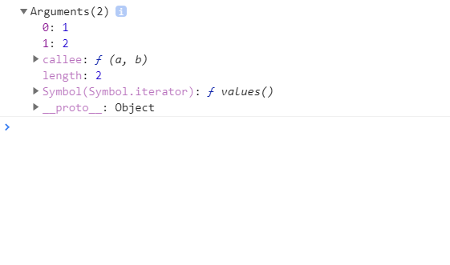

<!-- TOC -->

- [JS基础](#js基础)
    - [函数(function)](#函数function)
        - [函数的概念和引入](#函数的概念和引入)
            - [函数的概念](#函数的概念)
            - [函数的引入](#函数的引入)
    - [函数的定义](#函数的定义)
            - [函数的调用](#函数的调用)
    - [函数参数](#函数参数)
    - [return-返回值](#return-返回值)

<!-- /TOC -->


# 1. JS基础

## 1.1. 函数(function)

### 1.1.1. 函数的概念和引入

#### 1.1.1.1. 函数的概念
`JavaScript函数` 是被设计为执行特定任务的代码块。

#### 1.1.1.2. 函数的引入
引入函数的好处最大的好处是提高代码的复用。


## 1.2. 函数的定义
一个函数的定义(声明)是由一系列的 `function` 关键字组成，一次为
- 函数的名称
- 函数参数列表，包围在括号中并由逗号分隔
- 定义函数的 `JavaScript` 语句，用大括号 `{}` 括起来

>第一种函数定义方法：定义一个简单的 `square` 函数：
```
<script>
    function square(num){
        return num * num;
    }
    square(2);
</script>
```
函数 `square` 使用了一个参数，叫做 `num`，这个函数只有一个语句，它说明该函数将函数的参数(即number)自乘后返回，函数的 `return` 语句确定了函数的返回值。

该函数定义方式：定义函数和调用函数不论先后

>第二种函数定义方法：函数表达式
```
<script>
    var square = function(num){
        return num * num;
    }
    square(2);
</script>
```
该函数定义方式：调用函数只能在定义函数之后


#### 1.2.1. 函数的调用
定义一个函数时并不会自动的执行它，定义了的函数仅仅是赋予函数以名称并确定函数被调用时该做些什么。`调用函数` 才会以给定的参数的参数真正执行这些动作。例如上面定义的 `square` 函数，我们可以这样调用：`square(2)` ;

## 1.3. 函数参数

`形式参数` ：也叫形参，在方法括号中的参数

`实际参数` ：也叫实参，调用方法传的参数

我们可以通过下面的这个例子：
```
<script>
    var sum = function(a, b){
        document.write(a+b);
    }
    sum(1,2);
</script>
```
从上面的例子可以看出 `sum` 函数中的a和b指的就是`形参`, 1和2指的是 `实参`。


在函数内置中有一个 `arguments` 来接收我们所传的参数。如图：



上述提到的 `arguments` 对象是所有(非箭头)函数中都可用的 `局部变量`。我们可以使用 `arguments` 对象再函数中引用函数的参数。此对象包含传递给函数的每个参数，第一个参数在0处。

例如：如果一个函数传递了三个参数，你可以如下方式去引用它们
```
<script>
    var sum = function(a, b){
        console.log(arguments[0]);
        console.log(arguments[1]);
    }
    sum(1, 2);
</script>
```

当然参数还可以被设置如下：
```
<script>
    var sum = function(a, b){
        arguments[0] = "new values";
        arguments[1] = "new values";
    }
    sum(1, 2);
</script>
```

`arguments` 对象不是一个 `Array`。但它类似于 `Array`，但除了 `length` 的属性和索引元素之外没有任何 `Array` 属性。例如，它没有 `pop` 方法，但是它可以被转换为一个真正的 `Array`。


## 1.4. return-返回值

`return`：指的是结束函数调用，意思是调用函数后会返回一个值，并且执行到 `return` 语句后，直接退出，其后面的代码不会被执行。
```
<script>
    function getSum(a, b) {
        // return a + b;
        if (arguments.length === getSum.length) {
            console.log("flow over!");
        } else {
            console.log("传递的参数个数不匹配！");
        }
    }
    // var result = getSum(2, 3);
    // console.log(result);
    console.log(getSum(1));
    console.log(getSum(1, 2));
    console.log(getSum(1, 2, 3));
</script>
```

